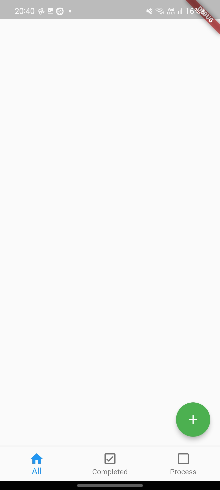
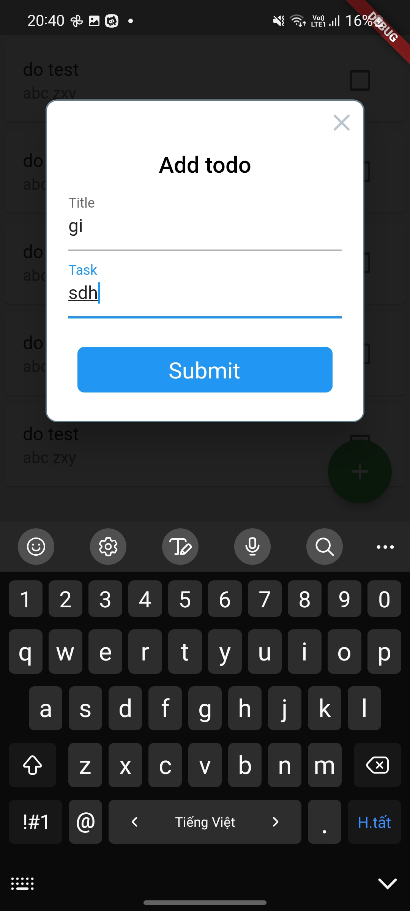
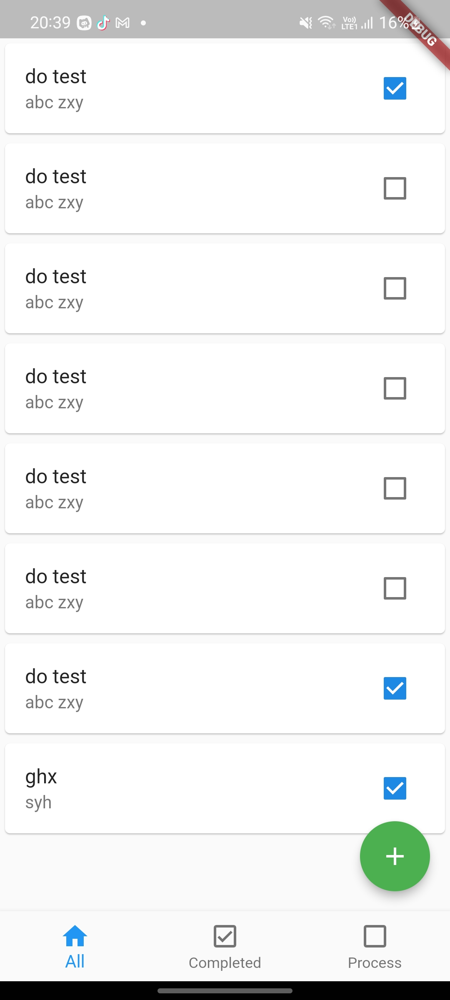
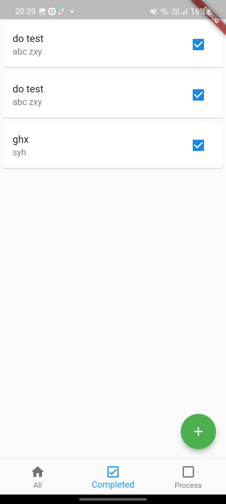
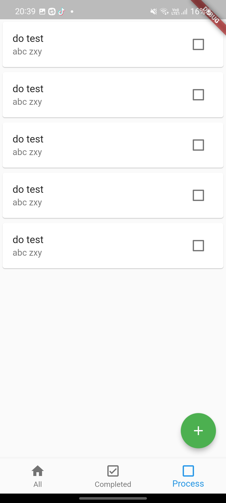

## Todo app ⌒
todo app

## Previews ⛶

  

  

  

## Feature roadmap ⌲
* [x] UI
* [x] Accessibility
* [x] GetX State Management
* [x] Add new todo
* [x] Update todo
* [x] Delete todo
* [x] Filter todo
* [x] Controller unit-test
* [x] Widget-test

